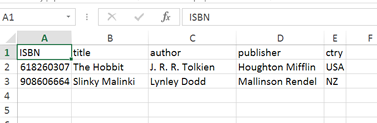
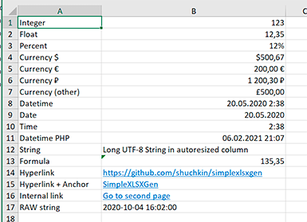
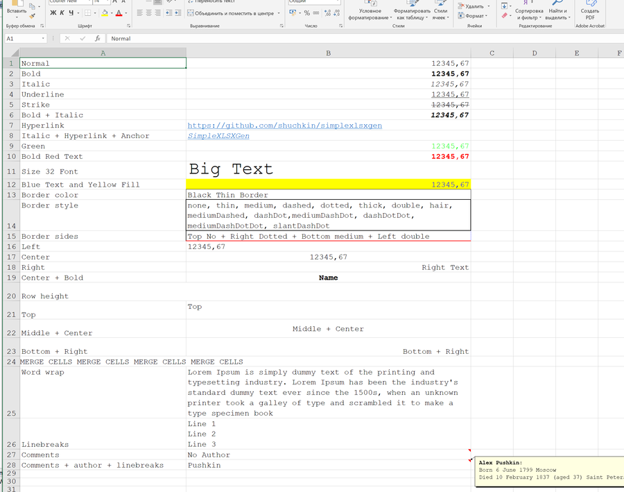

# SimpleXLSXGen
[](https://github.com/shuchkin/simplexlsxgen/blob/master/license.md) [](https://github.com/shuchkin/simplexlsxgen/stargazers) [](https://github.com/shuchkin/simplexlsxgen/network) [](https://github.com/shuchkin/simplexlsxgen/issues)

Export data to Excel XLSX file. PHP XLSX generator. No external tools and libraries.<br/>
(!) XLSX reader [here](https://github.com/shuchkin/simplexlsx).  

**Sergey Shuchkin** <sergey.shuchkin@gmail.com> 2020-2021<br/>

*Hey, bro, please ★ the package for my motivation :) and [donate](https://opencollective.com/simplexlsx) for more motivation!* 

## Basic Usage
```php
$books = [
    ['ISBN', 'title', 'author', 'publisher', 'ctry' ],
    [618260307, 'The Hobbit', 'J. R. R. Tolkien', 'Houghton Mifflin', 'USA'],
    [908606664, 'Slinky Malinki', 'Lynley Dodd', 'Mallinson Rendel', 'NZ']
];
$xlsx = SimpleXLSXGen::fromArray( $books );
$xlsx->saveAs('books.xlsx'); // or downloadAs('books.xlsx') or $xlsx_content = (string) $xlsx 
```


## Installation
The recommended way to install this library is [through Composer](https://getcomposer.org).
[New to Composer?](https://getcomposer.org/doc/00-intro.md)

This will install the latest supported version:
```bash
$ composer require shuchkin/simplexlsxgen
```
or download class [here](https://github.com/shuchkin/simplexlsxgen/blob/master/src/SimpleXLSXGen.php)

## Examples
### Data types
```php
$data = [
    ['Integer', 123],
    ['Float', 12.35],
    ['Percent', '12%'],
    ['Datetime', '2020-05-20 02:38:00'],
    ['Date','2020-05-20'],
    ['Time','02:38:00'],
    ['Datetime PHP', new DateTime('2021-02-06 21:07:00')],
    ['String', 'Long UTF-8 String in autoresized column'],
    ['Hyperlink', 'https://github.com/shuchkin/simplexlsxgen'],
    ['Hyperlink + Anchor', '<a href="https://github.com/shuchkin/simplexlsxgen">SimpleXLSXGen</a>'],
    ['RAW string', "\0".'2020-10-04 16:02:00']
];
SimpleXLSXGen::fromArray( $data )->saveAs('datatypes.xlsx');
```


### Formatting
```php
$data = [
    ['Normal', '12345.67'],
    ['Bold', '<b>12345.67</b>'],
    ['Italic', '<i>12345.67</i>'],
    ['Underline', '<u>12345.67</u>'],
    ['Strike', '<s>12345.67</s>'],
    ['Bold + Italic', '<b><i>12345.67</i></b>'],
    ['Hyperlink', 'https://github.com/shuchkin/simplexlsxgen'],
    ['Italic + Hyperlink + Anchor', '<i><a href="https://github.com/shuchkin/simplexlsxgen">SimpleXLSXGen</a></i>'],
    ['Left', '<left>12345.67</left>'],
    ['Center', '<center>12345.67</center>'],
    ['Right', '<right>Right Text</right>'],
    ['Center + Bold', '<center><b>Name</b></center>']
];
SimpleXLSXGen::fromArray( $data )
    ->setDefaultFont( 'Courier New' )
    ->setDefaultFontSize( 14 )
    ->saveAs('styles_and_tags.xlsx');
```


### More examples
```php
// Fluid interface, output to browser for download
SimpleXLSXGen::fromArray( $books )->downloadAs('table.xlsx');

// Fluid interface, multiple sheets
SimpleXLSXGen::fromArray( $books )->addSheet( $books2 )->download();

// Alternative interface, sheet name, get xlsx content
$xlsx_cache = (string) (new SimpleXLSXGen)->addSheet( $books, 'Modern style');

// Classic interface
$xlsx = new SimpleXLSXGen();
$xlsx->addSheet( $books, 'Catalog 2021' );
$xlsx->addSheet( $books2, 'Stephen King catalog');
$xlsx->downloadAs('books_2021.xlsx');
exit();
```

## Debug
```php
ini_set('error_reporting', E_ALL );
ini_set('display_errors', 1 );

$data = [
    ['Debug', 123]
]
SimpleXLSXGen::fromArray( $data )->saveAs('debug.xlsx');
```